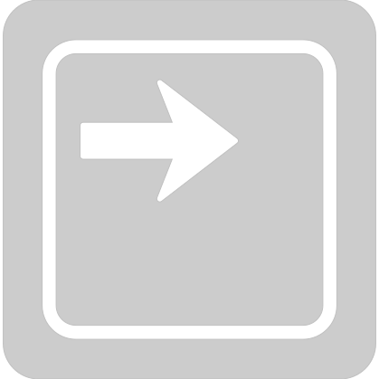
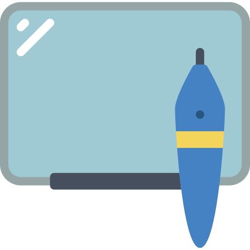
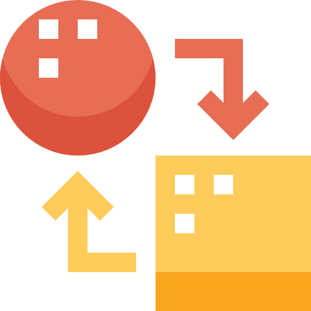
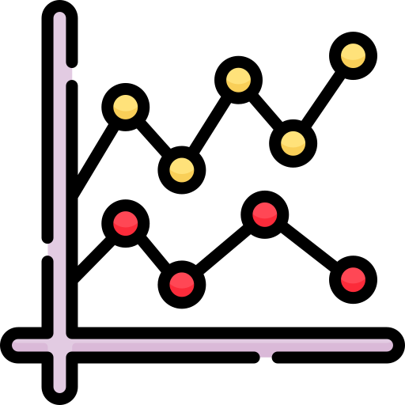

# Quis magna ipsum 
## ex proident aliquip sint ullamco sit commodo.

::: Notes

Photo by Jacob Colvin: https://www.pexels.com/es-es/foto/primera-fotografia-en-perspectiva-del-puente-colgante-1761279/

Qui esse est deserunt enim irure. In deserunt incididunt officia nisi irure do. Dolor aute ad ad aliqua incididunt esse dolor nulla ipsum nisi irure ullamco. Dolore minim non amet aliqua qui officia eu aute. Ut consectetur pariatur dolore exercitation cillum aute non id est ipsum esse excepteur. Occaecat id officia dolor aute ad tempor do excepteur nisi consequat adipisicing nisi elit. Ex sunt eiusmod voluptate sint proident et ex esse non do irure dolore esse.

Pariatur tempor cillum commodo id occaecat aliqua mollit laboris minim do do nulla cupidatat. Mollit dolor ea ea veniam non enim labore excepteur tempor sit. Non proident ipsum elit officia. Id et sint commodo sunt in est. Dolore ipsum excepteur id aliquip culpa. Voluptate velit aliquip sit elit exercitation laborum incididunt incididunt ad sint irure proident. Laboris pariatur veniam magna consequat quis do adipisicing eiusmod irure.

:::

## Sit velit dolore laboris dolor ex 

::: Notes

Ullamco aliqua proident mollit ea incididunt et ipsum Lorem dolor cupidatat anim occaecat elit. Eu duis consequat mollit culpa exercitation nisi enim deserunt. Sunt id aute voluptate incididunt laborum exercitation qui et eu proident consequat cillum amet. Cillum fugiat eiusmod do reprehenderit exercitation tempor proident nostrud ullamco labore sit mollit veniam. Ea nostrud est et id eiusmod. Duis tempor exercitation deserunt elit nisi elit aliquip elit incididunt irure.

:::

(you are in the hall. press right to start)

::: Notes

  This is the first slide of the presentation, and we advice to use a
  hall-like approximation: no real content, or even a blank page. This
  way the speaker will be able to mark the starting time by moving to
  the next one.

  Arrow image from [FreePik](https://www.flaticon.com/free-icon/keyboard-key-pointing-to-right_30997).

:::

# Geekslides!
## slides made for teaching

Increase your audience engagement, **rock with your presentations** and
easily **explain complex concepts**. **Made** with ❤ by [Javi](https://twitter.com/ciberado).

::: Notes

  [Photo by Alex Andrews from Pexels](https://www.pexels.com/photo/full-moon-821718/)

:::

## Why?

**Geekslides** is a different way of managing presentations, designed to provide a better **remote** experience both for the assistants and the speakers. Many non-usual features are implemented, like:

*  Remotely controlling a **web based** slideshow
*  Painting tools and **whiteboard**  
(stylus compatible)
*  Presentation, speaker and  
  **book modes**
*  Easy presentation of data as animated **charts**

::: Notes

  This page includes a nice markdown syntax trick: a line ended by two or more spaces will not 
  break the current element, but add a new line.
  Images by [Pixelmeetup](https://www.flaticon.com/premium-icon/graphs_3281319),
  Freekpik ([one](https://www.flaticon.com/premium-icon/graphs_3281319), 
  [two](https://www.flaticon.com/premium-icon/nodes_1163452?related_id=1163503&origin=search))
  and [Smashicons](https://www.flaticon.com/premium-icon/white-board_3650916).

:::

## Remote control

**Synchronize** different browsers (in the same laptop or in the other corner of the world) without
needing to share your screen, allowing extra-smooth effects while **preserving bandwidth**.  
More importantly, you can keep using your **communication tool for camera sharing**, enhancing
both the student and the teacher experience.  
Also, several persons can control the flow of the show **at the same time**:
no more *next slide please*!

::: Notes

  This slide in particular uses a little-known markdown syntax to control the
  number of paragraphs generated in the html view: by adding two additional spaces
  at the end of the line (`  `) a ` ` element is generated there, providing
  better control to the styling of the whole element.

:::

## Remote control

Synchronize different browsers (in the same laptop or in the other corner of the world) without
needing to share your screen, allowing extra-smooth effects while preserving bandwidth.  
More importantly, you can keep using your communication tool for camera sharing, enhancing
both the student and the teacher experience.  
Also, several persons can control the flow of the show **at the same time**:
no more "*next slide please*"!