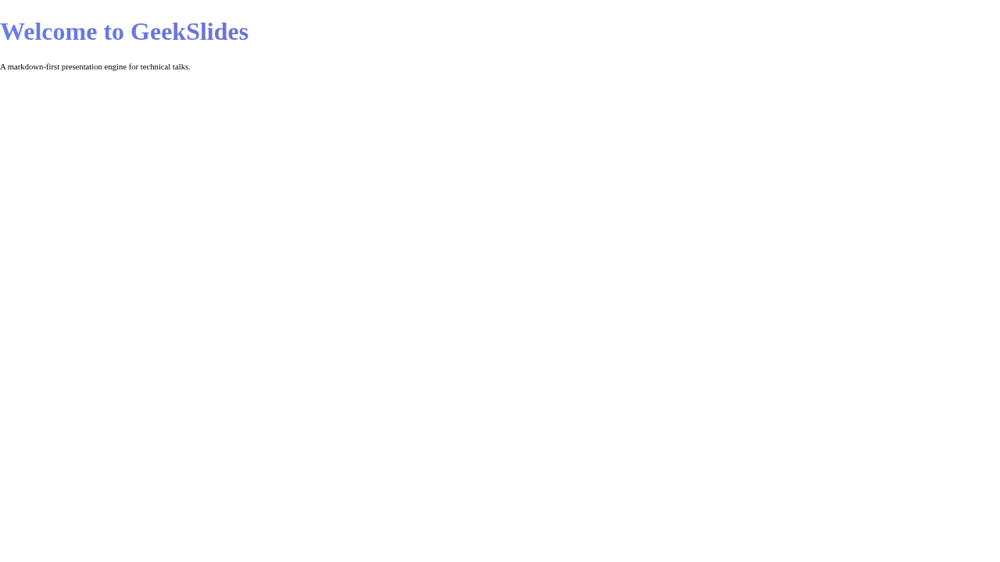

# Install the CLI

GeekSlides is a Node.js application distributed as an npm workspace. This guide walks you through installation and verifying the setup.

## Prerequisites

- **Node.js 22** or later ([download](https://nodejs.org/))
- **npm 10+** (ships with Node 22)
- **Git** (for cloning the repository)

Verify your environment:

```bash
node --version   # v22.x.x or higher
npm --version    # 10.x.x or higher
git --version
```

## Clone and install

```bash
git clone https://github.com/ciberado/geekslides.git
cd geekslides
npm ci
```

`npm ci` installs exact versions from the lockfile and links the three workspace packages:

| Package | Role |
|---|---|
| `@geekslides/engine` | Core rendering engine, components, sync |
| `@geekslides/server` | WebSocket sync server + content proxy |
| `@geekslides/cli` | CLI commands: `dev`, `build`, `pdf`, `create` |

## Verify the installation

Build all packages and run the test suite:

```bash
npm run build
npm test
```

If everything passes, you're ready to go.

## Start the development server

The quickest way to see GeekSlides in action:

```bash
npm run dev
```

This starts two processes concurrently:

1. **Vite dev server** on `http://localhost:5173` — serves the SPA and your deck
2. **Yjs WebSocket server** on `ws://localhost:1234` — handles real-time sync

Open `http://localhost:5173` in your browser. You'll see the sample deck loaded and ready.



> **No sync needed?** Use `npm run dev:nosync` to skip the WebSocket server.

## Available CLI commands

Once installed, the `geekslides` command is available through `npx`:

```bash
npx geekslides --help
```

| Command | Purpose |
|---|---|
| `geekslides dev` | Start dev server with HMR and optional sync |
| `geekslides build` | Build a production-ready static bundle |
| `geekslides pdf` | Export your deck to PDF (multiple formats) |
| `geekslides create` | Scaffold a new presentation |

Each command is covered in detail in the following guides.

## Troubleshooting

**`npm ci` fails with peer dependency errors**
Make sure you're on Node 22+. Earlier versions may not satisfy all peer constraints.

**Port 5173 already in use**
Either stop the other process or use a custom port:
```bash
npx geekslides dev --port 3000
```

**Browser shows a blank page**
Check the terminal for Vite errors. A common cause is a malformed `config.json` in the deck directory.

---

Next: [Create Your First Deck →](02-create-your-first-deck.md)
