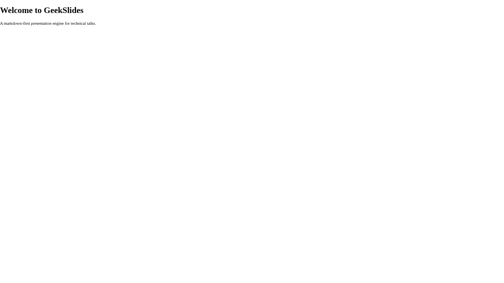
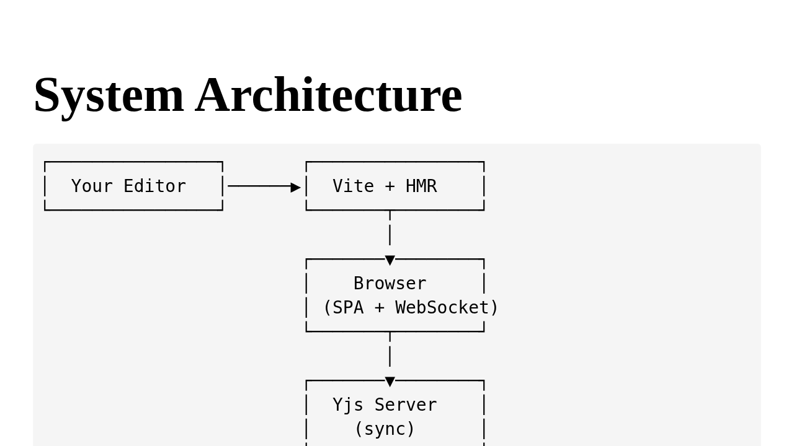

# Create Your First Deck

A GeekSlides deck is just a directory with a few files. This guide shows you how to scaffold one and understand what each piece does.

## Scaffold with the CLI

The fastest way to start:

```bash
npx geekslides create --title "My First Talk" --dir my-first-talk
```

This creates the following structure:

```
my-first-talk/
├── config.json              # Deck metadata and settings
├── README.md                # Your slide content (Markdown)
├── css/
│   ├── layouts.css          # Slide layout rules (grid, flex, spacing)
│   ├── theme-default.css    # Default colour and typography theme
│   └── local.css            # Your per-deck overrides
└── images/                  # Image assets
```

## Anatomy of a deck

### config.json

The configuration file tells GeekSlides how to load and render your deck:

```json
{
  "title": "My First Talk",
  "content": "README.md",
  "styles": ["css/layouts.css", "css/theme-default.css", "css/local.css"],
  "aspectRatio": "16/9",
  "plugins": {
    "preprocessors": []
  }
}
```

| Field | What it does |
|---|---|
| `title` | Page title shown in the browser tab |
| `content` | Path to the Markdown file with your slides |
| `styles` | Array of CSS files to load (order matters) |
| `aspectRatio` | Slide aspect ratio — `"16/9"` or `"4/3"` |
| `plugins.preprocessors` | Markdown transforms applied before parsing (empty = none) |
| `plugins.processors` | Slide transforms applied after parsing |

> **Tip:** The scaffolded deck uses explicit `[]()` slide markers (see below), so `preprocessors` is empty by default. You can add `"header"` to the array if you prefer to use bare Markdown headings as slide separators instead.

### README.md — Your slides

Each slide starts with a **slide marker** — an empty Markdown link:

```markdown
[](#intro)
# Welcome to My First Talk

This is the first slide.

[](#agenda)
## Agenda

- Topic one
- Topic two
- Topic three
```

The `#intro` and `#agenda` parts are optional IDs. They create anchor-friendly URLs and help you reference slides.



### css/ — Stylesheets

Three CSS files ship with every new deck:

- **`layouts.css`** — structural layout rules (grid, flex, spacing). Controls how content is arranged inside each slide type. Usually left unchanged.
- **`theme-default.css`** — colours, fonts, and decorative styles. This is your starting point for a visual theme.
- **`local.css`** — per-deck overrides. Start here when you want to tweak fonts or colours without editing the full theme.

A typical `local.css` looks like:

```css
/* Override font and accent colour for this deck */
:host {
  --gs-font-family: 'Inter', system-ui, sans-serif;
  --gs-accent: #e94560;
}
```

Changes to CSS files are hot-reloaded instantly — no page refresh needed.

See [Style Your Deck](07-style-your-deck.md) for the full guide to the layout and theme system.

### images/

Drop your images here and reference them in Markdown:

```markdown

```

## Launch the dev server

Point the dev server at your deck:

```bash
npx geekslides dev --config my-first-talk/config.json
```

Open `http://localhost:5173` and you'll see your slides.

> **Tip:** The `?config=` URL parameter also accepts a directory path — `config.json` is appended automatically. So `?config=my-first-talk` and `?config=my-first-talk/config.json` are equivalent. Edit `README.md` in your editor and watch the changes appear in real time — the current slide position is preserved.



## Deck file conventions

A few rules of thumb:

- **One Markdown file per deck.** All your slides live in a single `README.md` (or whatever `content` points to).
- **Images go in `images/`.** Keep paths relative: `images/photo.jpg`.
- **CSS supports @import.** Split stylesheets if they grow large.
- **config.json is authoritative.** The dev server watches it for changes. Non-structural edits (title, styles) hot-reload; structural changes (plugins) trigger a full reload.

---

Next: [Evolve Your Deck →](03-evolve-your-deck.md)
