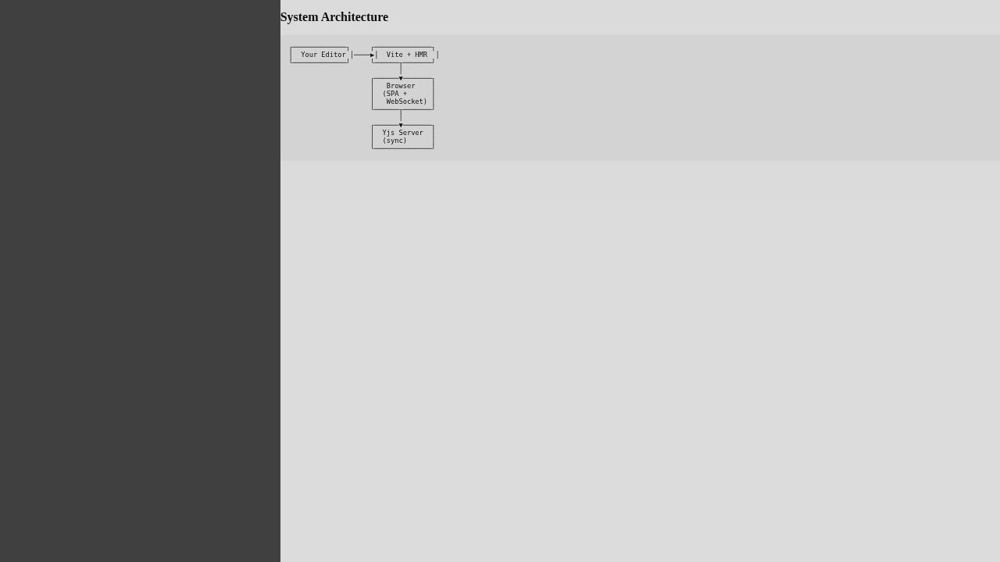
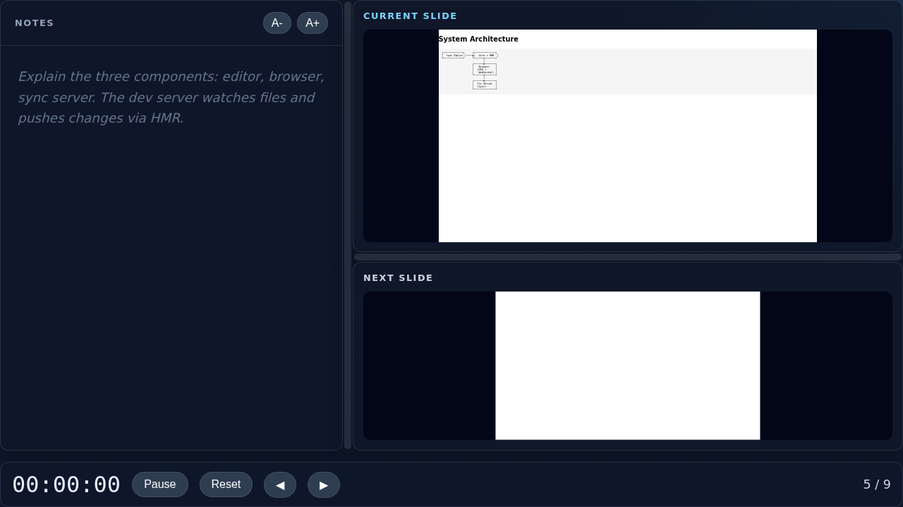

# Evolve Your Deck

You have a working deck. Now let's turn it into something worth presenting — progressive reveals, speaker notes, per-slide styling, background images, and more.

## Progressive reveals with partials

Partials let you reveal content step by step. Add the `.partial` class to a slide marker and each list item becomes a reveal step:

```markdown
[](.partial#benefits)
## Why GeekSlides?

- Markdown-first workflow
- Real-time sync across devices
- Speaker notes and PDF export
- Runs anywhere Docker runs
```

Press `→` or `Space` to reveal one item at a time. Already-revealed items stay visible; upcoming items are hidden.



### Inline partials

For finer control, use inline syntax inside any slide (no `.partial` class needed):

```markdown
[](#timeline)
## Project Timeline

* [Phase 1: Research]
* [Phase 2: Prototype]
* [Phase 3: Ship it]
```

Each `[bracketed item]` becomes a separate reveal step.

## Speaker notes

Wrap notes in a `:::` fenced block. They appear only in speaker view — your audience never sees them:

```markdown
[](#key-metric)
## Performance Results

We reduced latency by 40%.

::: Notes
Mention the baseline was 200ms p99.
Emphasize this was measured under production load, not synthetic benchmarks.
Talk about the caching strategy that made this possible.
:::
```

Notes support full Markdown — links, code blocks, lists, emphasis — so you can keep detailed reminders without cluttering the slide.



## Details blocks

Details blocks are like speaker notes but intended for *readers*, not presenters. They appear in the `slides-details` PDF export format and are hidden during the live presentation:

```markdown
[](#architecture)
## System Architecture


::: Details
The system follows a three-tier model:
- **Frontend**: Static SPA served from CDN
- **API Layer**: Node.js on ECS Fargate
- **Data Layer**: Aurora Serverless v2 with read replicas

The API layer auto-scales based on CPU utilization with a target of 60%.
:::
```

## Per-slide custom CSS

Drop a `<style>` tag anywhere inside a slide. It's scoped to that slide only:

```markdown
[](#highlight-slide)
## Key Takeaway

The important thing is **consistency**.

<style>
h2 { color: #e94560; font-size: 3.5rem; }
section.content { 
  background: linear-gradient(135deg, #1a1a2e 0%, #16213e 100%);
  color: #eee;
}
</style>
```

This won't affect any other slide in your deck.

## Background images

Use the `.coverbg` class to set a full-bleed background image:

```markdown
[](.coverbg#hero)


## Going Serverless

<style>
h2 { color: white; text-shadow: 0 2px 8px rgba(0,0,0,0.7); }
</style>
```

The image fills the entire slide area. Combine with per-slide CSS for text readability over the image.

## Illustration slides

For image-heavy slides where the picture is the star, use `.illustration`:

```markdown
[](.illustration#diagram)
## Data Flow


```

This adjusts the layout to give the image maximum space.

## Plugins

Enable plugins in `config.json` to unlock extra capabilities:

### Chart processor

Turns Markdown tables into interactive Chart.js visualizations:

```json
{
  "plugins": {
    "processors": ["chart"]
  }
}
```

Then in your Markdown:

```markdown
[](#metrics)
## Monthly Active Users

| Month | Users |
|-------|-------|
| Jan   | 1200  |
| Feb   | 1800  |
| Mar   | 2400  |
| Apr   | 3100  |
```

The table renders as a chart on the slide.

### Video processor

Embed videos with timestamp-based partials:

```json
{
  "plugins": {
    "processors": ["video"]
  }
}
```

### iframe processor

Embed live web pages inside slides:

```json
{
  "plugins": {
    "processors": ["iframe"]
  }
}
```

## Structuring a longer deck

As your deck grows, keep it readable:

```markdown
[](#title)
# Scaling on AWS
### A practical guide

[](#agenda)
## Agenda
- Storage
- Compute
- Traffic management

<!-- ───────────── Section: Storage ───────────── -->

[](.partial#s3)
## Amazon S3
- Object storage for any workload
- 99.999999999% durability
- Lifecycle policies for cost optimization

::: Notes
Open the S3 console and show the bucket list.
Emphasize the eleven nines of durability.
:::

[](#s3-demo)
## S3 Demo


<!-- ───────────── Section: Compute ───────────── -->

[](.partial#compute)
## Auto Scaling Groups
- Launch templates define instance config
- Scaling policies react to CloudWatch alarms
- Predictive scaling for known patterns
```

HTML comments are ignored during rendering — use them freely as section dividers or personal notes.

## Live workflow

With `npm run dev` or `npx geekslides dev` running:

1. **Edit README.md** — content updates appear instantly, slide position preserved
2. **Edit local.css** — styles hot-reload without losing state
3. **Edit config.json** — non-structural changes (title, styles) hot-update; plugin changes trigger full reload
4. **Add images** — drop files in `images/`, reference them in Markdown, see them immediately

This edit-and-see loop is the core workflow. There's no build step during development.

---

Next: [Present Like a Pro →](04-present-like-a-pro.md)
