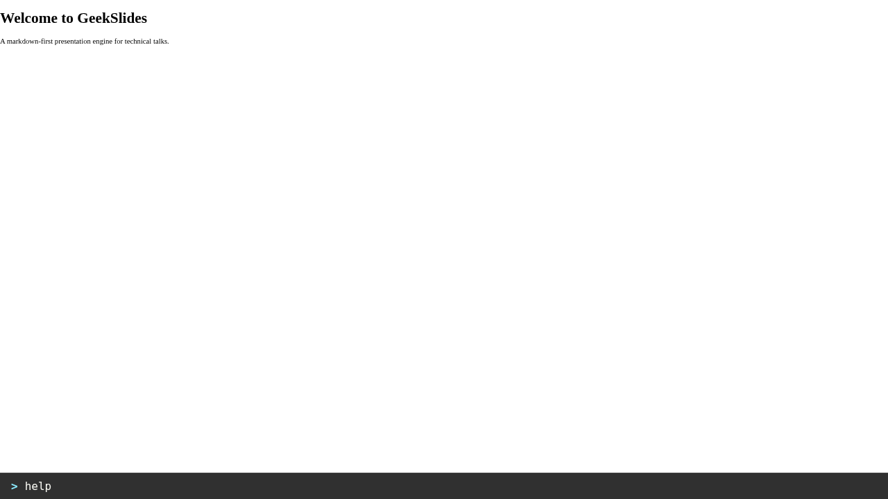
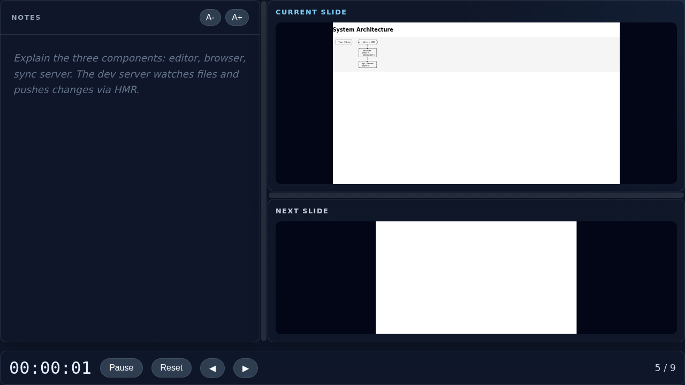
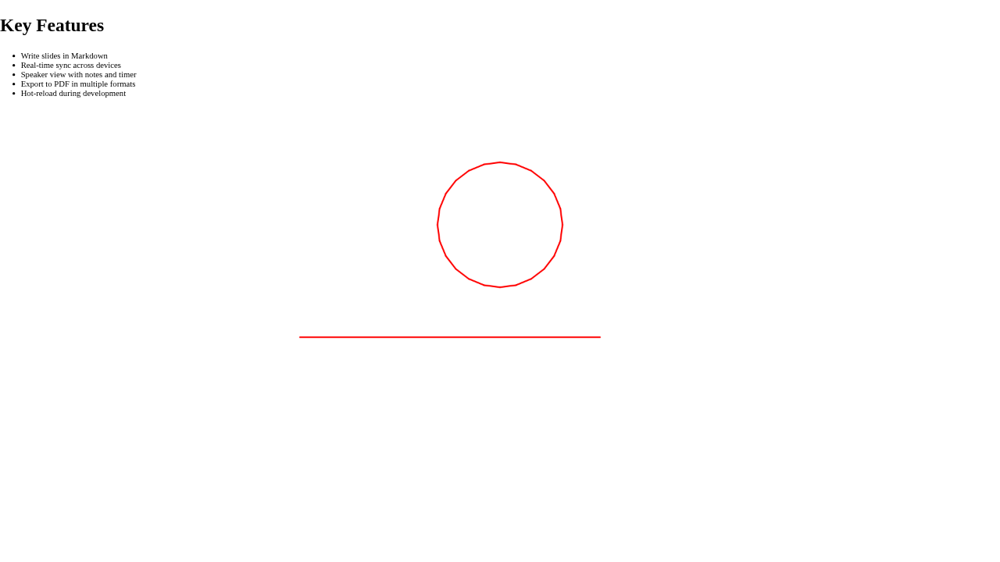

# Present Like a Pro

You've built your deck. Now it's showtime. This guide covers everything you need to navigate, present, and engage your audience — from keyboard shortcuts to real-time sync across devices.

## Basic navigation

These keys work at all times, no prefix needed:

| Key | Action |
|---|---|
| `→` or `Space` | Next slide or reveal next partial |
| `←` | Previous slide or hide last partial |
| `↑` / `↓` | Previous / next slide (skips partials) |
| `Page Down` | Next slide |
| `Page Up` | Previous slide |
| `Home` | Jump to first slide |
| `End` | Jump to last slide |
| `Esc` | Toggle command terminal |
| `?` | Show keyboard shortcuts overlay |

That's the minimum. Arrow keys and Space will get you through any talk.

## Progress indicator

A thin progress bar at the bottom edge and a slide counter (e.g. `3 / 15`) in the bottom-right corner track your position. Both are hidden in overview mode.

## The terminal

Press `Esc` to toggle the command terminal — a text prompt at the bottom of the screen. Press `Esc` again to close it. The terminal opens regardless of what is currently in focus.

You can also **drag the top edge** of the terminal panel up or down to resize it.



### Essential terminal commands

| Command | What it does |
|---|---|
| `help` | Show all available commands |
| `go 5` | Jump to slide 5 |
| `go-first` | Jump to the first slide |
| `go-last` | Jump to the last slide |
| `fullscreen` | Toggle fullscreen mode |
| `overview` | Toggle overview mode (slide grid) |
| `speaker` | Open/toggle speaker view |
| `whiteboard` | Toggle the drawing canvas |
| `clear` | Clear whiteboard strokes on current slide |
| `wb-pen` | Switch to pen tool |
| `wb-highlighter` | Switch to highlighter tool |
| `wb-eraser` | Switch to eraser tool |
| `wb-color <hex>` | Set drawing colour |
| `room myroom` | Join a sync room |
| `sync-follow` | Follow the presenter's position |
| `sync-disconnect` | Stop following |
| `load <url>` | Load a remote deck by config URL |

Press `Esc` again to close the terminal without running a command.

## Speaker view

Open a second browser tab (or window on a second monitor) with the `speaker` query parameter:

```
http://localhost:5173/?config=my-talk/config.json&view=speaker
```

Or type `speaker` in the terminal to open it.

The speaker view shows:

- **Left pane**: Your speaker notes (scrollable, full Markdown rendering)
- **Right pane**: Current slide on top, next slide preview below
- **Timer**: Elapsed time since the presentation started (top-right corner)
- **Clock**: Current wall-clock time next to the timer
- **Slide counter**: Current position (e.g. `5 / 12`)
- **Font controls**: `A-` / `A+` buttons to adjust notes font size on the fly



Partials that haven't been revealed yet appear dimmed in the speaker view, so you always know what's coming next.

> **Tip:** Both tabs sync state automatically. Navigate in either window and the other follows.

## The whiteboard

Draw on any slide to annotate content live. Two ways to activate it:

1. **Type `whiteboard`** in the terminal
2. **Just start drawing** — drag your mouse or pen on the slide and the canvas appears automatically

Each slide has its own canvas. Strokes persist when you navigate away and come back.

> **Tip:** While the whiteboard is active the canvas sits on top of the slide, so links
> and interactive elements underneath cannot be clicked. Use the **Hide (⊘)** button in
> the toolbar (or the `whiteboard` toggle command) to dismiss the canvas and restore
> click-through to the slide content.

### The toolbar

When the whiteboard is active a collapsible toolbar appears on the right edge of the slide:

- **Pen** — thin, fully opaque line (default)
- **Highlighter** — wide, semi-transparent stroke for emphasis
- **Eraser** — removes strokes under the cursor

Below the tools you'll find a **4 × 4 colour palette** with 16 colours. Click any swatch to change the drawing colour.

Action buttons at the bottom:

| Button | Action |
|---|---|
| **Hide (⊘)** | Hide the whiteboard for the current slide |
| **Clear (✕)** | Erase all strokes — double-click to confirm |

Click the **≡** button at the top to collapse or expand the toolbar.

### Terminal commands

All toolbar actions are also available from the terminal:

| Command | Action |
|---|---|
| `wb-toolbar` | Toggle toolbar collapsed / expanded |
| `wb-hide` | Hide toolbar |
| `wb-show` | Show toolbar |
| `wb-pen` | Switch to pen |
| `wb-highlighter` | Switch to highlighter |
| `wb-eraser` | Switch to eraser |
| `wb-color <hex>` | Set colour, e.g. `wb-color #ff0000` |
| `clear` | Clear whiteboard strokes on current slide |



> When sync is enabled, whiteboard strokes are shared with all connected viewers in real time.

## Mobile support

GeekSlides works on phones and tablets:

| Gesture | Action |
|---|---|
| Swipe left | Next slide |
| Swipe right | Previous slide |
| Swipe up | Toggle overview mode |
| Tap right edge (25%) | Next |
| Tap left edge (25%) | Previous |
| Tap centre (50%) | No action (dead zone) |
| Long press (500 ms) | Toggle toolbar |

The left and right tap zones each cover 25% of the screen width, leaving a 50% centre dead zone to prevent accidental navigation.

## The toolbar

The toolbar is a floating bar with quick-access buttons for common commands. It is hidden by default and designed primarily for touch/mobile use.

| Button | Command |
|---|---|
| ◀ | Previous slide |
| ▶ | Next slide |
| ⊞ | Toggle overview |
| ⛶ | Toggle fullscreen |
| ✎ | Toggle whiteboard |
| 🎤 | Open speaker view |

**Open the toolbar** by long-pressing on a touchscreen, or by typing `toggle-toolbar` in the terminal. Tap any button to trigger the command. The toolbar auto-hides in overview mode.

## Real-time sync

Sync lets your audience see exactly what you see, in real time. It uses Yjs (a CRDT library) over WebSocket — no account or login needed.

### Start a sync session

1. Start the dev server with sync enabled (default):
   ```bash
   npm run dev
   ```

2. Open your deck:
   ```
   http://localhost:5173/?config=my-talk/config.json&room=demo-session
   ```

3. Share the URL with your audience. Everyone who opens the same `room` parameter sees the same slide state.

### Sync status indicator

A small dot in the top-right corner shows sync state at a glance:

| Color | Meaning |
|---|---|
| Green | Connected and following the presenter |
| Orange | Connected but browsing independently |
| Grey | Disconnected |

### How sync works

- The **presenter** navigates slides — all connected viewers follow along
- **Partial reveals**, **whiteboard strokes**, and **slide position** are all synced
- Viewers can use `sync-disconnect` to browse independently, and `sync-follow` to re-attach
- The Yjs server has no persistent state — if it restarts, clients reconnect and re-sync automatically

### Content proxy

When sync is active, GeekSlides automatically uploads your deck assets (images, CSS, config) to the server. Remote viewers fetch content from the server instead of needing access to your local machine.

This means your audience only needs the server URL — they don't need to be on your network or have your files.

## Fullscreen

Press `F11` or type `fullscreen` in the terminal. The slide fills the entire screen with proper aspect-ratio scaling.

## Overview mode

Type `overview` in the terminal (or swipe up on mobile) to see all slides in a scrollable grid. Click any thumbnail to jump to that slide and return to presentation mode. The current slide is highlighted with a blue border.

## Presentation checklist

Before going live:

- [ ] Run through all slides once to verify content and partials
- [ ] Open speaker view on a second screen
- [ ] Test sync by opening the `?room=...` URL on your phone
- [ ] Check that images load (especially if using the content proxy)
- [ ] Set font size in speaker notes to your preference

---

Next: [Deploy the Server →](05-deploy-the-server.md)
