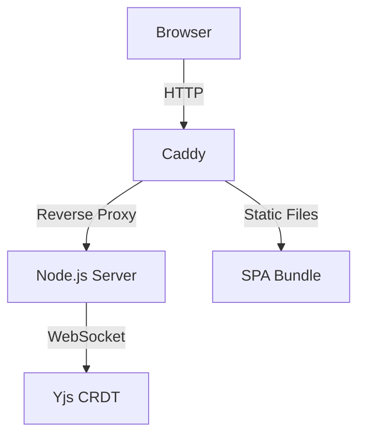
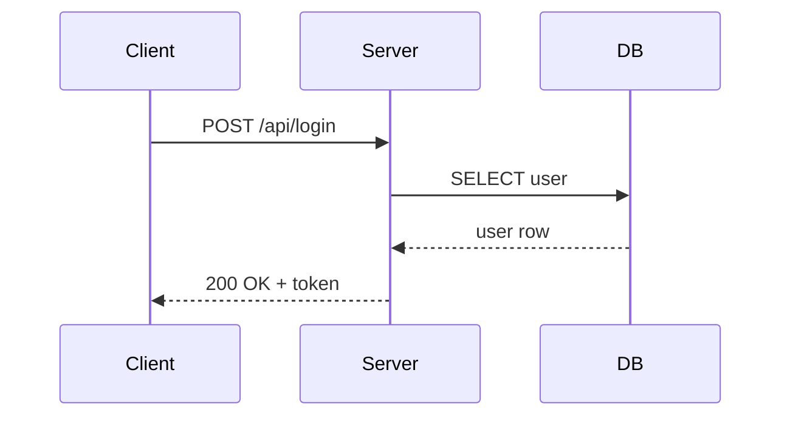
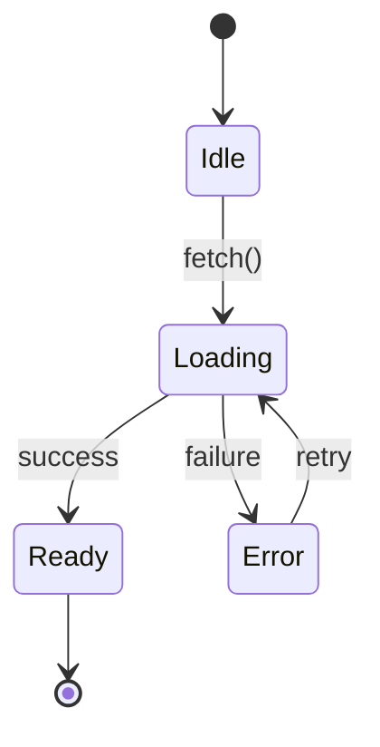
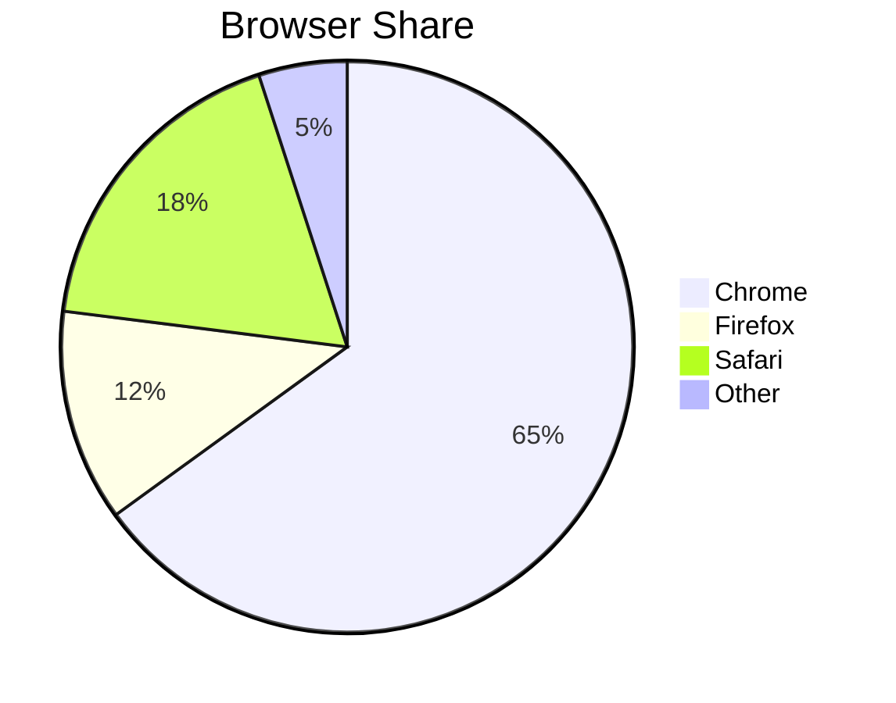

# Add Mermaid Diagrams

Render flowcharts, sequence diagrams, and other Mermaid diagrams directly in your slides. Write standard Mermaid syntax in fenced code blocks and GeekSlides converts them to SVG at runtime — no pre-export step needed.

## Enable the mermaid processor

Add `"mermaid"` to the processors list in your deck's `config.json`:

```json
{
  "title": "My Presentation",
  "content": "README.md",
  "plugins": {
    "preprocessors": ["header"],
    "processors": ["iframe", "mermaid"]
  }
}
```

That's it. The mermaid library is loaded lazily — it only downloads when your deck contains a mermaid code block.

## Write a diagram

Use a fenced code block with the `mermaid` language tag:

````markdown
## Architecture


````

This renders as an SVG flowchart inside the slide.

## Supported diagram types

Mermaid supports many diagram types out of the box:

| Type | Opening keyword | Example use case |
|---|---|---|
| Flowchart | `graph TD` or `graph LR` | Architecture, decision trees |
| Sequence | `sequenceDiagram` | API call flows, protocol exchanges |
| Class | `classDiagram` | Object models, type hierarchies |
| State | `stateDiagram-v2` | Lifecycle states, workflows |
| Entity-Relationship | `erDiagram` | Database schemas |
| Gantt | `gantt` | Timelines, project schedules |
| Pie | `pie` | Proportional data |
| Git graph | `gitGraph` | Branch strategies |
| Mindmap | `mindmap` | Brainstorming, topic overviews |

See the [Mermaid documentation](https://mermaid.js.org/intro/) for the full syntax reference.

## Examples

### Sequence diagram

````markdown

````

### State diagram

````markdown

````

### Pie chart

````markdown

````

## How it works

The `mermaid` processor runs after slides are rendered to the DOM:

1. Finds every `<pre><code class="language-mermaid">` element in the slide.
2. Extracts the text content as a Mermaid definition string.
3. Dynamically imports the Mermaid library (only on first use).
4. Calls `mermaid.render()` to produce an SVG string.
5. Replaces the `<pre>` block with a `<div class="gs-mermaid">` containing the SVG.

Rendering is asynchronous — the diagram appears once the SVG is ready. If a diagram has a syntax error, the original code block stays visible and gains a `gs-mermaid-error` CSS class so you can style it.

## Styling diagrams

The mermaid processor uses the `dark` theme by default, which works well on typical slide backgrounds. You can adjust diagram sizing with CSS in your `local.css`:

```css
.gs-mermaid {
  max-width: 80%;
  margin: 0 auto;
}

.gs-mermaid svg {
  max-height: 70vh;
}
```

To style error states (e.g. highlight broken diagrams during development):

```css
pre.gs-mermaid-error {
  border: 2px solid #f87171;
  border-radius: 8px;
  padding: 1rem;
}
```

## Tips

> **Tip:** Keep diagrams simple on slides. A flowchart with 5–8 nodes works well; 20+ nodes will be too small to read. Break complex diagrams across multiple slides.

> **Tip:** For maximum compatibility with PDF export, keep diagrams under 800px wide. The book PDF format extracts slide images, so the SVG renders correctly there too.

> **Tip:** If you need a diagram in a deck that doesn't use the mermaid processor, export it as an SVG/PNG file and include it with standard markdown image syntax: ``.

## Troubleshooting

| Problem | Solution |
|---|---|
| Diagram shows as raw code | Check that `"mermaid"` is in your `config.json` processors list |
| Syntax error in diagram | Check the browser console for `[mermaid] Failed to render diagram` and fix the Mermaid syntax |
| Diagram too large for slide | Reduce the number of nodes or use `max-width` CSS to constrain it |
| Slow initial render | The mermaid library (~800 KB) loads on first use; subsequent diagrams render instantly |

---

← Previous: [Use the Docker CLI](10-use-the-docker-cli.md) | Back to [index →](README.md)
