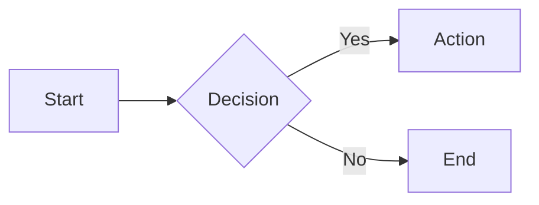
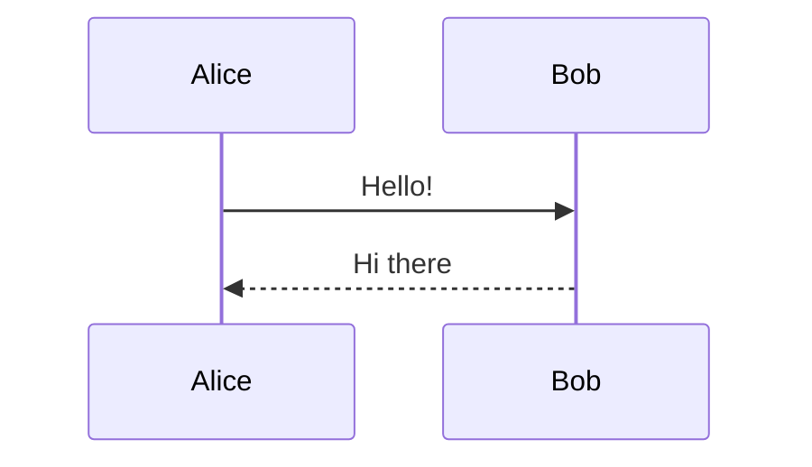
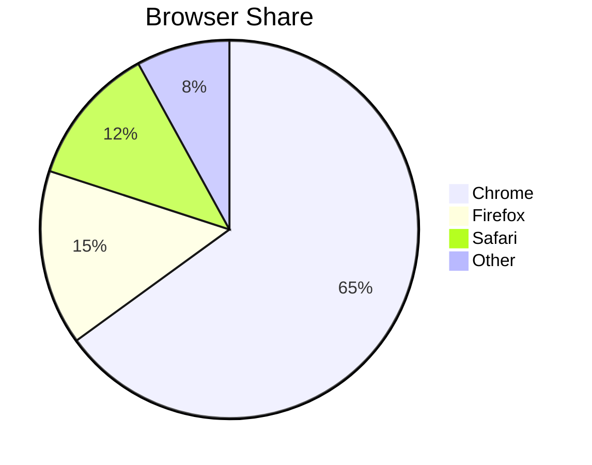

# mermaid

Renders [Mermaid](https://mermaid.js.org/) diagrams inside slides. Write a fenced code block with the `mermaid` language tag and the processor converts it to an inline SVG at render time.

## What it provides

| Part | Name | Role |
|------|------|------|
| Processor | `mermaid` | Replaces ` ```mermaid ``` ` blocks with Mermaid SVG diagrams |

The Mermaid library is loaded lazily on first use — it adds no weight to slides that don't use diagrams.

## Usage

```json
{ "plugins": ["mermaid"] }
```

## Markdown syntax

````markdown

````

````markdown

````

````markdown

````

Any [diagram type supported by Mermaid](https://mermaid.js.org/intro/#diagram-types) works: flowchart, sequence, class, state, ER, Gantt, pie, git graph, etc.

## Theme

Diagrams are rendered with Mermaid's built-in `dark` theme. This can be overridden by calling `mermaid.initialize()` in a custom script loaded via `config.scripts`.

## Notes

- The `mermaid` plugin does not pull in `core`. If you also want heading-based slide separators, add `core` explicitly: `plugins: ["core", "mermaid"]`.
- Rendering is asynchronous; complex diagrams may take a moment on first display.
